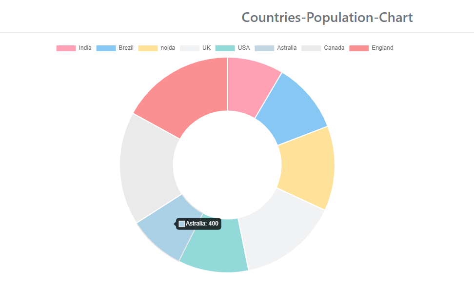

# doughnut-chart-angular

doughnut-char is a simple component used to show any kind of data in chart format which is designed in angular.


<p align="center">
    
</p>

To preview demo of Dynamic form creation by json data Component, [Click here](https://angular-nxvn9r.stackblitz.io/)

## Using the complete angular component

Download the src folder from population-chart folder and install the required packages and run the application.

### Installing

```
> npm install
```

### Run server

```
> ng serve
```

## Adding population-chart component in your project
 Download the population-chart component from population-chart/src/app folder to your angular project and include required components from angular.

``` html

<app-image-slider [imagesData]='imagesData'></app-image-slider>
<app-population-chart [populationDat]=this.populationDatas></app-population-chart>

```
populationDatas is the input for the population-chart of type **PopulationTypes**

### PopulationTypes Interface

```typescript

PopulationTypes{
countryName:string;
populationCount:number;
} 
  
```

#### Interface Description
- **countryName** it provides the country name,
- **populationCount**   it provides the total population of the country.

### Example JSON File
```  
populationDatas:PopulationTypes[]=[
{"countryName":"India",
"populationCount":400
},
{"countryName":"Brezil",
"populationCount":500
},
{"countryName":"noida",
"populationCount":600
},
{"countryName":"UK",
"populationCount":700
},
{"countryName":"USA",
"populationCount":500
},
{"countryName":"Astralia",
"populationCount":400
},
{"countryName":"Canada",
"populationCount":800
},
{"countryName":"England",
"populationCount":800
},
]
```

## How it works
  
   User will pass the data in property binding format i.e like above mentioned tag
    then Json data object will hold this information and gives to **input decorator**
    
### @Input Decorator

     @Input() populationDat;
